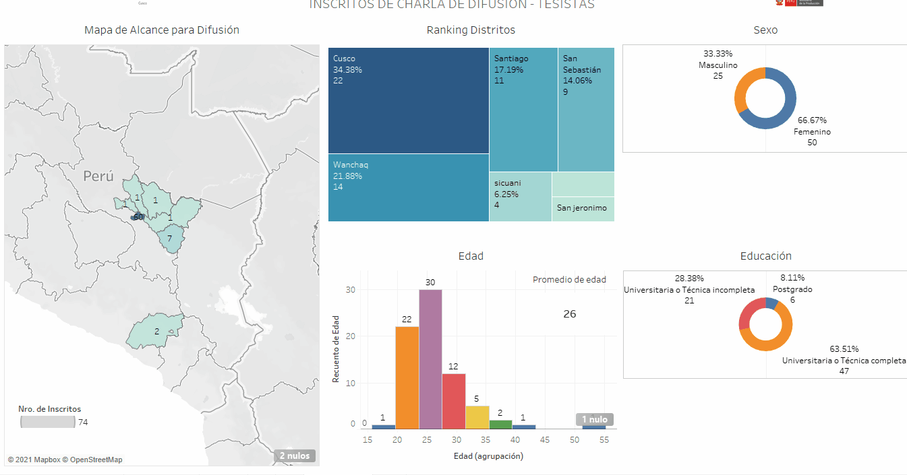

 
<mark>
<a href="https://public.tableau.com/profile/cite.textil.cam.lidos.cusco#!/vizhome/Charla-tesistas/Dashboard1"><big>Difusión para Investigación - Charla</big> </a>
</mark>

<h3>Resumen</h3>

Desarrollo de charla de difusión impartida por Jefferson Quispe Pinares, el dia 23 de marzo con el objetivo de llevar a la comunidad académica los programas de investigación que abarca el Instituo Tecnlógico de la Producción. Se ha hehco un muestreo con los inscritos para desarrollar un análisis descriptivo del perfil de nuestro clientes.    Los inscritos son 72 de la región de Cusco y 2 de Arequipa, la mayoria se concentran en la provincia de Cusco. El promedio de la edad es de 26 años entres participantes de de postgrado, universitaria completa y incompleta (8%, 28% y 64% respectivamente).Con una acpetación mayor de público femenino.  

<h3>Conclusiones</h3>
La aceptación para esta difusión bueno mejor de la esperada. Cabe resltar que en el sector e han interesado personanas del sexo femenino. Como el evento estaba dirigido para universitarios no se ha registrado personas con educación básica. EL desarrollo de tesis se aplica en campo y por ello bueno soalmente buena la acogida en la región. 
Cabe resaltar que la mayoria de los interesados fueron de UNSAAC.

<h3>Recomendaciones</h3>
Articular con comunidades académicas que permitan tener mayor alcance. 
Realizar vigilancia tencológica en investigación para palntearlos retos a estudiantes.  