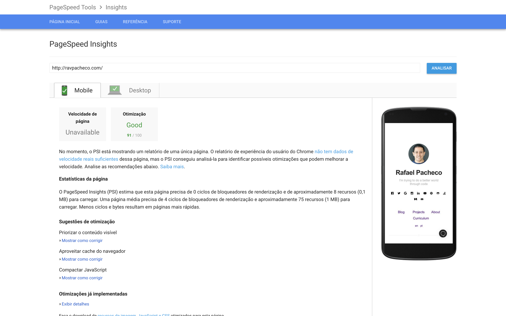

 
<mark>
<a href="https://public.tableau.com/profile/cite.textil.cam.lidos.cusco#!/vizhome/CHARLA-SERVICIOS/Historia1"><big>Historia Servicios Charla</big> </a>
</mark>

<h3>Objetivo</h3>

<h3>Conclusiones</h3>