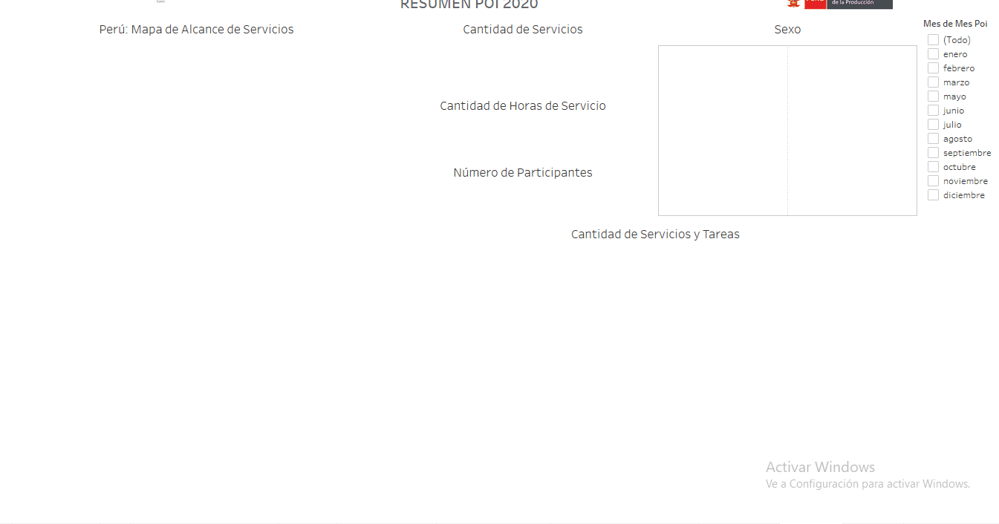

 
<mark>
<a href="https://public.tableau.com/profile/cite.textil.cam.lidos.cusco#!/vizhome/mediamovil/Resumen"><big>Resumen POI 2020</big> </a>
</mark>

<h3>Resumen</h3>
Este resumen del POI Anual esta basada en el reporte de la Dirección de Investigación, Dearrollo Innovación y Transferencia Tecnológica (DIDITT). Según dicha fuente el CITE Textil Camélidos Cusco ha desarrollado 1594 servicios, con un alcance 	de 1582 participantes, con 15220 de horas acumuladas. Estos servicios el 60% han sidos desarrolladas en la región de Cusco, mientras que los otros servicios son distribuidos entres otras regiones como Lima, Puno, Arequipa en mayor proporción. El 65% han sido mujeres. La tarea que mas se ha desarrollado es la capacitación básica, con 660 servicios. La charlas técnicas son las siguientes mas desarrolladas con 660. Repecto a la tarea con menor cantidad se refiere a la Formulación de Proyectos I+D+i. 

