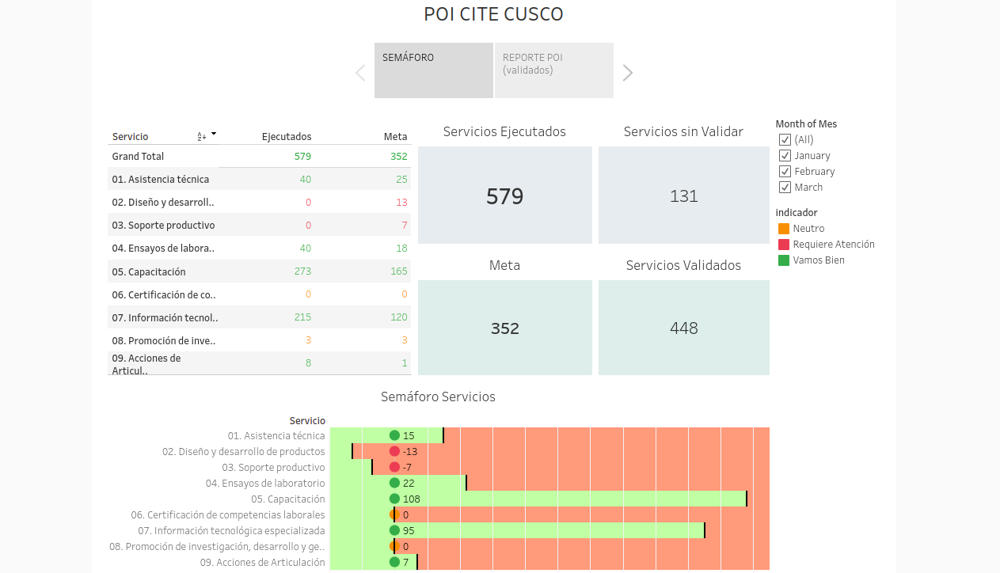

 
<mark>
<a href="https://public.tableau.com/profile/cite.textil.cam.lidos.cusco#!/vizhome/POTCITECUSCO/Historia1"><big>Semáforo POI 2021</big> </a>
</mark>

<h3>Objetivo</h3>

El objetivo de este Dashboard es la de obtener una herramienta útil para que el equipo monitoree el avance de los servicios según el POI, moniteorear si de acuerdo a las metas mensuales se estan logrando dar servicios a los clientes del CITE. El semáforo indica tres estados: "Vamos bien" cuando los servicios son superiores a las metas, "Neutro" si los servicios efectuados son las mismas que las metas, "Requiere Atención" cuando la cantidad de servicios no son los suficientes para llegar a los servicios meta. Cabe resaltar que se considera los servicios validados por el ITP + los servicios preliminares por semana para calcular los servicios.

En la segunda hoja, corresponde a los reporte mensuales de los servicios validados por el ITP, resaltando por meses la ubicación geográfica del cliente, su sexo, el tipo de empresa y el tipo de complejidad. Tambíen se puede desarrollar los filtros según eas características.  

