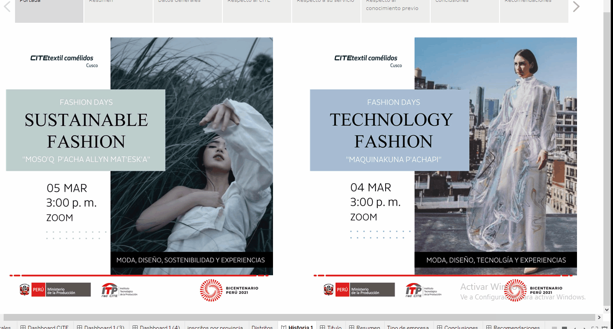

 
<mark>
<a href="https://public.tableau.com/profile/cite.textil.cam.lidos.cusco#!/vizhome/Libro3_16172442600350/Historia1"><big>Historia de Capacitación de Fashion Day's</big> </a>
</mark>

<h3>Resumen</h3>

El evento se desarrollo el 4 y 5 de marzo liderada porla dieñadora Paula García.
Se ha registrado 410 personas. Tambien se registro participantes de Colombia, Mexico, Bolivia, Ecuador,Francia y Honduras. En el evento 100 son los inscritos de la región de Cusco. Los distritos con mayor acogida fueron Cusco y Sicuani.
En este evento el 78% pertencen al genero femenino y se inscribieron el 45% el mismo dia del inicio del evento. El 51% poseen estudios técnico o universitarios concluidos. El grupo etario con mayor número de inscritos 28.61 % . Los inscritos en el evento no han recibido 60% servicio alguno del CITE. El 58% de la cadena de valor pertenece al diseño de prendas. Entre 30 a 50 soles es elprecio que podrian pagar por una charla del CITE. Los inscritos en us mayoria afirman que han visto los cursos de marketing digital, teñidos, exportaciones desarrollados or el CITE. Y sobre prendas, moda, diseño y tejidos son los temas que les gustaria aprender.

<h3>Conclusiones</h3>
* En evento de este tipo el interes por mujeres borde casi el 80% de interesados.
* El interés del evento puede abordar espacios internacionales.
* El interes de la cadena de elaboración de prendas es una de las mas importante a nivel densidad por la cantidad de Unidades Porductivas asociadas a esta.
* Es importante desarrollar módulo respecto a temas como elaboración de prendas, moda, diseño y tejidos.
* Existen Unidades Productivas que estan siguiendo las capacitaciones y charlas del CITE de forma continua.
* Es necesario elaborar una estrategia de marketing para llegar a las Unidades Productivas que desconocen de los servicios del CITE.

<h3>Recomendaciones</h3>
* Desarrollar estrategias para enviar servicios a las Unidades Productivas que no recibieron un servicio (de preferencia Cusco).
* Mejorar la formulacion de la pregunta sobre de cuanto pagarian por cursos del CITE.
* Segmentar clientes en función al eslabon de la cadena de valor a la cual pertenecen.

